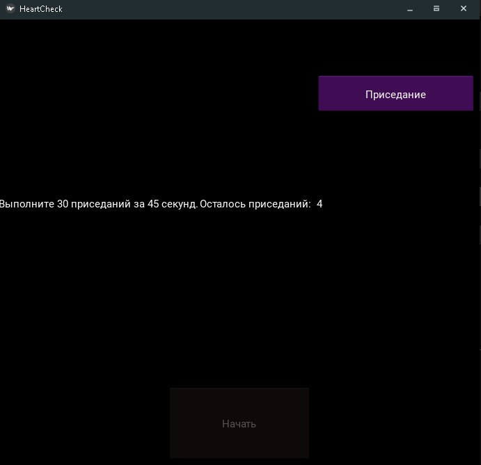

# Приложение - Тест Руфьера

Это приложение сделанно специально для теста Руфьера 


## Для создания самого приложения, использовался модуль Kivy

 - [Ссылка на оффициальный сайт Kivy](https://kivy.org/#home)

## Зачем вообще оно создано?


1) Для тестирования своих личных навыков в Kivy.


2) Для того чтобы люди могли пройти данный тест легко и быстро.


## Установка библеотеки Kivy

Зайдите в cmd, либо можете вписывать команду ниже, в терминал, в PyCharm или любой другой IDE

```bash
  pip install kivy
```
    
## Импорт необходимых модулей

```javascript
from kivy.app import App
from kivy.uix.screenmanager import ScreenManager, Screen 
from kivy.uix.button import Button
from kivy.uix.boxlayout import BoxLayout
from kivy.uix.textinput import TextInput
from kivy.uix.label import Label
from kivy.core.window import Window
# Тут уже импортируются собственные модули
from rufier import test # считает итоговый результат теста
from instructions import * # необходимые тексты для Label объектов
from seconds import * # подсчет секунд
from sits import * # подсчет приседаний
from runner import * # создание анимации
```


## Начало
НУжно задать переменные размера окна приложения, возраста, имени и переменные которые помогут сменить окно.
```bash
Window.size = (690,640)


age = 7 
name = ''
p1, p2, p3 = 0, 0, 0
```
Попытка проверки переменной на число.

```bash
 def check_int(str_num):
    try:
        return int(str_num)
    except:
        return False
```
Создание первого окна.

```bash
 class InStrScr(Screen):
    def __init__(self, **kw):
        super().__init__(**kw)
        
        instr = Label(text=txt_instruction) # делаем надпись и берем заготовленный текст с модуля instructions 
        lbl1 = Label(text='Введите имя', halign='right') # еще одна напрись
        self.in_name = TextInput(multiline=False) # создаем поле ввода №1 
        lbl2 = Label(text='Введите возраст', halign='right')  # еще одна напрись
        self.in_age = TextInput(text='7', multiline=False) # создаем поле ввода №2
        self.in_age = TextInput(text='7', multiline=False) # создаем поле ввода №3
        self.btn = Button(text='Начать', size_hint=(.3, .2), pos_hint={'center_x': .5}, background_color=[.5,.1,1,7]) # создание кнопки
        self.btn.on_press = self.next # реакция на нажатие кнопки
        
        # создаем слои на которых мы будем располагть наши виджиты

        line1 = BoxLayout(size_hint=(.8,None),height='30sp')
        line2 = BoxLayout(size_hint=(.8,None),height='30sp')
        line1.add_widget(lbl1)
        line1.add_widget(self.in_name)
        line2.add_widget(lbl2)
        line2.add_widget(self.in_age)
        outer = BoxLayout(orientation='vertical',padding=8, spacing=8)
        outer.add_widget(instr)
        outer.add_widget(line1)
        outer.add_widget(line2)
        outer.add_widget(self.btn)
        self.add_widget(outer)
        
    def next(self): # функция для смены окна
        global name
        name = self.in_name.text
        self.manager.current = 'pulse1'
```

Остальные окна похожи за исключением функции next()
```bash 
 def next(self): # в ней происходит проверка не вписал ли человек пустое значение в пульс
        if not self.next_screen:
            self.btn.set_disabled(True)
            self.lbl_sec.start()
        else: 
            global p1
            p1 = check_int(self.in_result.text)
            if p1 == False or p1 <= 0:
                p1 = 0
                self.in_result.text = str(p1)
            else:
                self.manager.current = 'sits'
```
Идет добавление окон как виджитов в ScreenManger (контроль окон)
```bash 
 class HeartCheck(App):
    def build(self):
        sm = ScreenManager()
        sm.add_widget(InStrScr(name='instr'))
        sm.add_widget(PulseScr(name='pulse1'))
        sm.add_widget(CheckSits(name='sits'))
        sm.add_widget(PulseScr2(name='pulse2'))
        sm.add_widget(Result(name='result'))
        return sm
```


## Authors

- [@owlnikita](https://github.com/owlnikita)




